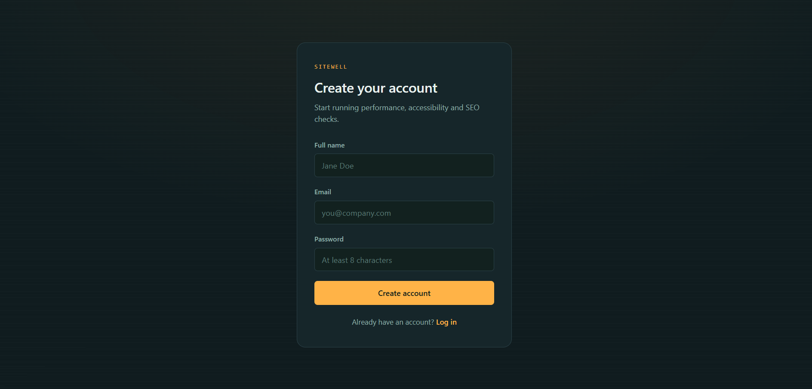
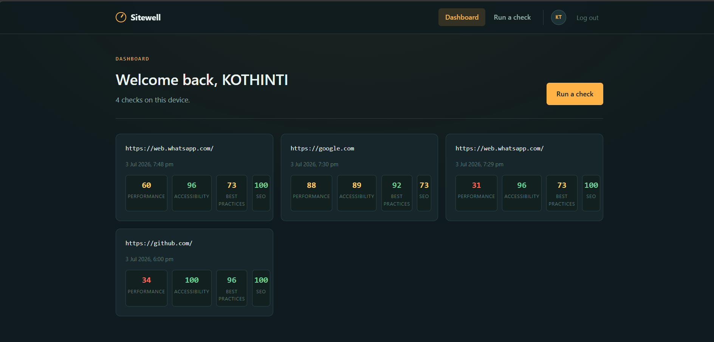
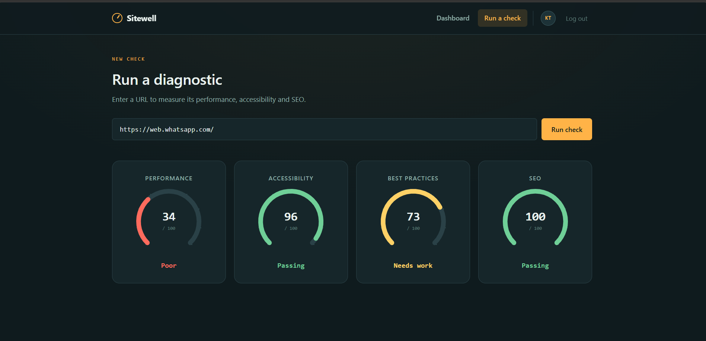

# 🚀 SiteWell

A full-stack Website Performance Analyzer that evaluates websites using the Google PageSpeed Insights API.

## 🌐 Live Demo

Frontend:
https://site-well-kappa.vercel.app/login

Backend:
https://sitewell.onrender.com

---

## Features

- User Registration
- Secure Login (JWT Authentication)
- Password Encryption using bcrypt
- Website Performance Analysis
- Accessibility Score
- SEO Score
- Best Practices Score
- Protected Routes
- MongoDB Atlas Database
- Responsive UI
- Deployment on Vercel & Render

---

## Tech Stack

### Frontend
- React.js
- Vite
- JavaScript
- HTML
- CSS

### Backend
- Node.js
- Express.js

### Database
- MongoDB Atlas
- Mongoose

### Authentication
- JWT
- bcrypt.js

### APIs
- Google PageSpeed Insights API

---

## Installation

### Clone Repository

```bash
git clone https://github.com/KothintiTharun035/SiteWell.git
```

### Backend

```bash
cd Server
npm install
npm run dev
```

### Frontend

```bash
cd Client
npm install
npm run dev
```

---

## Environment Variables

### Backend (.env)

```
PORT=8000
MONGO_DB_URL=your_mongodb_connection_string
JWT_SECRET=your_secret_key
PAGESPEED_API_KEY=your_api_key
```

### Frontend (.env)

```
VITE_API_BASE_URL=http://localhost:8000
```

---

## Screenshots

### Login


### Register



### Dashboard



### Analysis


---

## Author

**Tharun Kothinti**

GitHub:
https://github.com/KothintiTharun035